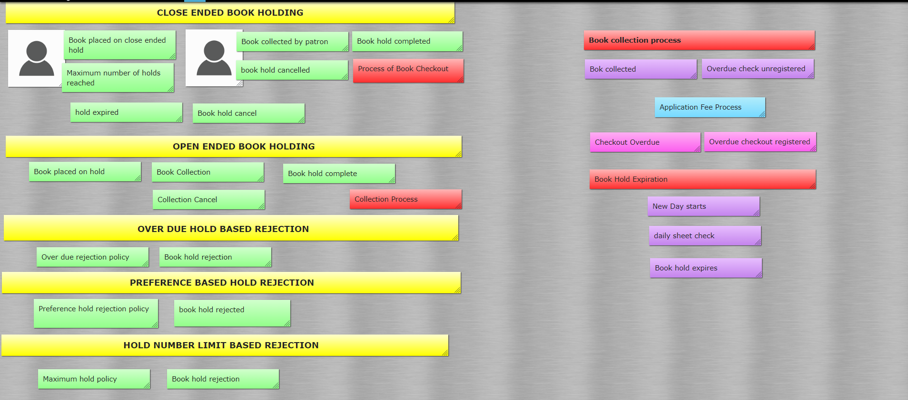

# LibraryManagamentSystem
This project is a small console based library management system application.
# DDD
# Domain Background
At its numerous library branches, a public library allows its users to place books on hold. Only one customer may place a hold on any particular set of available books at any given moment. There may be retrieval or usage costs for books that are either limited or circulated. Only a researcher patron may check out a restricted book. Regular users are only permitted five holds at a time, but researchers are permitted an infinite amount of holds. Until the customer checks out the book, an open-ended book hold is in effect. At that point, it is finished. A closed-ended book hold will expire if it is not finished within a predetermined period of time after it was requested. At the start of each day, this check is performed by looking at the daily document with expiring holdings. An open-ended hold time can only be requested by researchers. If a user attempts to place a hold at the same library branch with more than two late checkouts, their request will be rejected. A book may be borrowed for as long as 60 days. Examining the daily sheet with the overdue checkouts allows one to check for overdue checkouts. Look at the patron profile to interact with your existing holds, checkouts, etc. The information in the patron profile is specific to one person and is not always updated daily, despite the fact that it looks like a daily sheet.
How does a customer actually know which books are available for loan? The library contains a book catalogue where books are uploaded together with their unique instances. Only if there is already a book in the catalog with the same ISBN may a particular book instance of a book be added. Both the book's title and price must not be empty. We choose whether an instance will be currently circulating or Restricted at the time of introducing it. This permits us to simultaneously have a book with the same ISBN that is disseminated and limited.
# Assumptions
The process starts with exploring the domain with the help of Big Picture Event storming. After having an event storming session there were many discoveries made:
 
 
# Definitions
Fromt the event stroming session following definitions were discovered:
## Patron
a person who lends a book from library
## Available Book
a book that can be placed on hold
## Restricted Book
a book which can be held by researcher patron only
## Book on hold
a book which is held by a patron currently
## Collected Book
a book which is succesfuly collected by a patron
## Catalogue
Set of books
## Hold Duration
the time period in which a book can be held
## Checkout
colleciton of book from library
## Overdue Checkout
an overdue occurs when a patron doesnt return the book he held after 60 days of colleciton
## daily sheet
a sheet that contains data of expired hold
# Domain Mapping
The following domain mapping has been developed after event stroming session. The main core domain is Library resource management and the subdomains include resorces, users profiles and application fee domain.

# UML
UML is unified modelling language that is used for visually representing the system being developed. 
## Class Diagram
A description of a group of objects all with similar roles in the system, which consists of: structural featurs as attributes and behavioural features as operations in it. Here is the class diagram of the library management system. 

## Usecase diagram
In the Unified Modeling Language (UML), a use case diagram can summarize the details of your system's users (also known as actors) and their interactions with the system. Here is the use case diagram of the library management system.

## Activity Diagram
Activity diagram is another important behavioral diagram in UML diagram to describe dynamic aspects of the system. Activity diagram is essentially an advanced version of flow chart that modeling the flow from one activity to another activity.Here is the activity diagram of the library management system. 

# METRICS
## SONARCUBE
### Complexity
It is the Cyclomatic Complexity, which is determined by the quantity of code pathways. The complexity counter is increased by one each time a function's control flow divides into two separate directions. Each function has a complexity that is at least 1. Because keywords and functionalities differ between languages, this computation differs a little bit.
### Security
It includes the number of vulnerbailities in the system and how they are handle in te project.
# Report Explaining Each Point
# 1. Git
I have used git to upload all the relevant files of the project. First I uploaded a readme which includes the details of the project then uploaded the java files the src files nd the test files on git. During this phase I have learned about different git commands like git init to create the new repo. To add the files on github I have learned that we can use git add –all command. Similarly to commit the changes made in the repo we can use git commit command with various arguments like -a to commit all changes, -m to commit with a message etc. I have learned that we can also push a local repo content on a git repo with the help of git push command. A big benefit of Github is that we can create branches with it.  Essentially, git branches are a reference to a copy of your modifications. No matter how big or tiny the bug, if you intend to add a new feature or correct one, you create a new branch to contain your changes. Branching makes it easier to create bug fixes, add new features, and integrate new versions once they have been through isolation testing. To create a new branch we can use git branch <branch name> command. 
# 2. UML
UML is a standard language for better understanding the project visually. For visualizing and describing software systems, UML is quite helpful. I have developed three diagrams of the project which includes the project use case diagram, activity diagram, and class diagram. Structure diagrams, interaction diagrams, and behavior diagrams are only a few of the subsets of diagrams included in the Unified Modeling Language. Activity diagrams are regarded as behavior diagrams since they specify what must occur in the system being represented, along with use case and state machine diagrams. An essential UML diagram for describing the system's dynamic elements is the activity diagram. An activity diagram is essentially a flowchart that shows how one activity leads to another. The action might be referred to as a system operation. One operation leads to the next in the control flow. This flow may be parallel, contemporaneous, or branched. Activity diagrams use many features, such as fork, join, etc., to cope with all types of flow control. An activity is a specific system function. Activity diagrams are used to build the executable system utilizing forward and reverse engineering approaches, as well as to visualize the dynamic nature of a system. The message portion is the only item the activity diagram is missing. No message flow from one activity to another is shown. Occasionally, an activity diagram is used in place of a flowchart. The diagrams are not flowcharts, despite their appearance. It displays various flows, including single, parallel, branching, and concurrent flows. Use-case diagrams aid in capturing system requirements and depict a system's behavior in UML.  The scope and high-level functions of a system are described in use-case diagrams. The interactions between both the system and its users are also depicted in these diagrams. Utilize-case diagrams show what the system does and how the users use it, but they do not show how the system works within.  The context and requirements of either the complete system or the key components of the system are illustrated and defined through use-case diagrams. A complicated system can be represented by a simple use-case diagram, or its various components can be represented by a number of use-case diagrams. The basic edifice of object-oriented modeling is the class diagram. It is used for detailed modeling, which converts the models into computer code, as well as for general conceptual modeling of the application's structure. Data modeling can also employ class diagrams.
The link to my uml diagrams is: [UML](https://github.com/WinterASE2022-23/LibraryManagementSystem/tree/main/LibraryManagamentSystem-main/images/UML)
# 3. DDD
The domain, or area of expertise, of individuals who will utilize it is at the center of the domain-driven design (DDD) software development concept. The method makes it possible to design software that is concentrated on the intricate needs of those who need it and doesn't waste time on anything unnecessary. It is a set of guidelines and patterns that aid designers in creating beautiful object systems. When used correctly, it can result in software abstractions known as domain models. These models bridge the gap between business fundamentals and code by encapsulating intricate business logic. During this project, It helped me in developing an approach which lead to abstraction of the project. It helped in understanding the business logic and bridge the gap between reality and code. It is used to ease the development of my project. I have created and added the DDD in my readme file in git. The link to file is: [DDD](https://github.com/WinterASE2022-23/LibraryManagementSystem/blob/main/README.md)
# 4. METRICES
Software metrics are measurements of quantifiable or countable software attributes. Measuring software performance, organizing tasks, gauging productivity, and many more purposes make software metrics crucial. Metrices are also included in the readme files. The two metrices I have chosen are complexity and security of the system. I have utilized the SonarQube metrices. Cyclomatic complexity, a quantitative metric used to determine the number of paths through the code, is referred to as complexity. The complexity counter is increased by one each time a function's control flow divides into two separate directions. Each function has a complexity that is at least 1. Because keywords and functionalities differ between languages, this computation differs a little bit. Metrics for software product security Give a numerical evaluation of the level of software system trustworthiness.
# 5.	CLEAN CODE DEVELOPMENT
I have utilized the clean code development approach for writing the code. I would like to highlight the points that I have used for clean code development.
1.	Build requires only one step. With just one click the project is build successfully.
2.	 Tests are also executed with just one step. 
3.	Naming conventions for methods, classes and variables are followed.
4.	Good commenting can be found in my code.
5.	Each Method does only one thing in my code.
6.	My code is consistent.
7.	Names are descriptive in my code.
8.	My code is simple (KISS) followed
Link to my CCD cheat sheat: [CCD](https://github.com/WinterASE2022-23/LibraryManagementSystem/tree/main/LibraryManagamentSystem-main/CCD)
# 6. BUILD
I have used maven for my project build. It is an open source automation tool that can be used for complete build lifecycle. The Apache Group created the well-known open-source build tool Maven to build, publish, and deploy several projects simultaneously for better project management. Developers can create and document the lifecycle framework using the provided tool. Maven does numerous helpful tasks, like Maven makes it simple to develop a project. With the aid of maven, adding jars and other project dependencies is simple. Maven offers project details (log document, dependency list, unit test reports etc.) When upgrading the central repository of JARs and other dependencies, Maven is very beneficial to a project. With the help of Maven we can build any number of projects into output types like the JAR, WAR etc without doing any scripting. We can easily integrate our project with a source control system using maven (such as Subversion or Git).
# 7. UNIT TESTS
Software testing with a focus on individual software system units or components is known as unit testing. Unit testing checks that each piece of software operates as intended and complies with specifications. Each time the code is modified, unit tests are automatically run to make sure that the new code won't break any functionality already in place. A function or method, for example, can be tested independently from the rest of the system using unit tests, which are created to check the smallest possible unit of code. As a result, early on in the development process, developers may immediately discover and address any errors, enhancing the software's overall quality and cutting down on the time needed for testing. I have created and upload test files on git. I have used Junit5 library in IntelliJ to create test cases for different methods in different classes of my code.
URL for test files: [Unit Tests](https://github.com/WinterASE2022-23/LibraryManagementSystem/tree/main/LibraryManagamentSystem-main/liberaryManagment/src/test/java)
# 8. CONTINOUS DELIVERY
Continuous delivery is a software development practice where code changes are automatically prepared for a release to production. Git action is used for continuous delivery of the project. Teams can dependably release their software at any moment by working in short cycles. Development teams can create, test, and distribute software more quickly and frequently with CD. They can consequently cut back on time, money, and risk when implementing each modification. Continuous delivery requires a reproducible deployment methodology. According to TechTarget, "developers frequently send off new code to the quality assurance (QA) and operations teams for testing" in continuous delivery, which can be seen as an extension of continuous integration. Continuous delivery, also known as CI/CD, is the second component of continuous integration that enables application development teams to quickly and frequently push incremental code updates to production. It is the automation to speed up the release of new code. It pushes the changes made into code to repository or container registry. The link to git actions for the project is: [Git Action](https://github.com/WinterASE2022-23/LibraryManagementSystem/tree/main/.github/workflows)
# 9. IDE
I have used IntelliJ for my project development. It is a very simple and easy IDE to use. I like working in it. I have created my project using maven  on IntelliJ. The shortcuts I like in IntelliJ are following:
 
Shift+F2	navigate between different issues in code
 
Ctrl+Alt+L  Reformat code
 
Ctrl+/ add a block comment. 
  
//
Alt+1 focus on tools of project
# 10. DSL
A programming language with such a higher level of abstraction that is tailored for a particular class of issues is known as a domain specific language. The ideas and regulations in the field or domain are used by a DSL. The complexity of a domain-specific language is typically lower than that of a general-purpose language like Java, C, or Ruby. DSLs are typically developed in close collaboration with the subject matter experts for the field for which they are being designed. DSLs are frequently designed to be utilized by persons who aren't software developers but are experts in the field the DSL handles. The use of DSLs has a lot of advantages. The most immediately apparent advantage of adopting DSLs is that, once you have a language and a transformation engine, your work in the specific area of software development covered by the DSL becomes considerably more efficient because you don't have to perform the tedious tasks by hand. You can employ excellent, domain-specific abstractions without incurring any runtime complexity if you create source code from your DSL program (as opposed to reading it), as the generator, like a compiler, can remove the abstractions and generate efficient code. The demo DSL code is not related to my project but I have added the demo at the following links: [DSL](https://github.com/WinterASE2022-23/LibraryManagementSystem/tree/main/LibraryManagamentSystem-main/DSL)
# 11. FUNCTIONAL REQUIRMENTS
The organization of code is based on functions, which are present in all higher level programming languages. Functional programming, in general, refers to the optimum use of functions for producing orderly and maintainable software. More specifically, functional programming refers to a group of coding methods that are frequently referred to as a programming paradigm.  Although it has been a trend in software development since the beginning, functional programming has gained new significance in the contemporary period. I have utilized functional programming in my code which can be seen in different methods, and different points in my code which is uploaded on git.
The link to source code: [Source Code](https://github.com/WinterASE2022-23/LibraryManagementSystem/tree/main/LibraryManagamentSystem-main/liberaryManagment/src/main/java)

